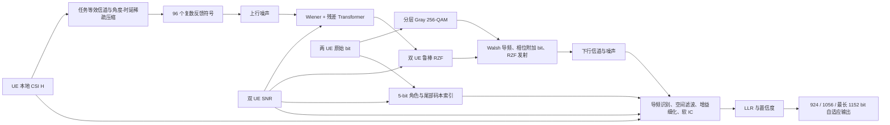

# FATE-MIMO V190 技术方案与消融实验总报告

版本：R1  
整理日期：2026-08-29  
当前冠军：V190  
代码基线：`main@aa9dcfd`，模型源提交 `1a7a9cf`  
发布标签：`solution-v190-mean-63.217950`

## 1. 执行摘要

当前方案 **FATE-MIMO V190** 是一套面向两用户 MU-MIMO 端到端链路的混合式方案。它没有把全部问题交给一个黑盒网络，而是把可解释通信模块、一个小型学习去噪器、共享控制语义和大量经消融确认的 SNR 分段专家组合起来：

1. UE 将 `2×16×144` 的瞬时 CSI 压缩为 96 个任务相关复数反馈符号；
2. BS 用解析 Wiener 与残差 Transformer 恢复每用户的分组等效信道；
3. 两用户联合 SNR 决定 Wiener 强度和鲁棒 RZF 正则化；
4. 下行采用分层 Gray 256-QAM、每 12 个子载波一个 Walsh 导频，以及导频相位附加比特；
5. 5-bit 控制字段同时协调用户角色并索引尾部码本；
6. Receiver 用本地真实信道、导频和 SNR 分段参数完成空间滤波、增益细化、软干扰抵消及 LLR 解调；
7. 输出长度由 SNR 和 LLR 置信度共同决定，避免低置信度 bit 拖累均值与公平 P10。

固定 seed1176/1177/1178 的官方兼容本地平均总分为 **63.217950**。相对 V115 的 62.827437 提升 **0.390513**，相对 V156 提升 **0.003924**，相对 V189 提升 **0.000901**。这些都是本地结果，尚无对应线上排行榜成绩，不能将其表述为线上最终分。

最重要的研究结论有三点：

- 去年获奖队伍广泛采用的 SNR 分区思想是有效的，但“每段独立训练一个网络”在本项目中没有稳定晋级；真正稳定的收益来自**按 SNR 路由小型物理参数专家**。
- 公平指标是离散且敏感的。V175 在发现集平均提升 `+0.010405`，却在盲测因 P10 跳档回退 `-0.018204`。加入弱用户保护门后形成 V189，才把同一思路转化为稳定收益。
- 小收益必须用同随机流配对比较、半块审计、冻结盲测和 C/A/B/AB 因子实验验证。V190 的增益虽小，但经过六个发现 seed、12 个半块和三个冻结盲测 seed，P10 均未恶化。

## 2. 赛题约束与优化目标

### 2.1 链路接口

当前代码严格遵守赛题接口：

| 项目 | 配置 |
| --- | ---: |
| 用户数 | 2 |
| BS 发射天线 | 16 |
| UE 接收天线 | 2 |
| 下行子载波 | 144 |
| 每 UE 上行反馈预算 | 96 个复符号 |
| 共享控制字段 | 5 bit |
| 每 UE 最大数据长度 | 1152 bit |
| 两 UE 最大总数据长度 | 2304 bit |
| 下行 SNR | `[-20,20] dB` |
| 上行反馈 SNR | `SNR_DL - 10 dB` |

### 2.2 评分函数意味着什么

单 UE 得分可写为：

\[
\mu=50+\frac{100}{1152}\sum_{k=1}^{B}
\left(\mathbf 1[\hat b_k=b_k]-0.5\right).
\]

本地总分使用：

\[
S_{final}=0.7\,\overline{\mu}+0.3\,P10(\mu).
\]

因此未输出的 bit 等效为 50% 正确率，不会直接扣分；只有准确率高于 50% 的新增 bit 才有正期望收益。最终策略不是盲目输出 1152 bit，而是在可靠区间尽可能输出，在不可靠区间保留高置信前缀或利用控制码本补尾。优化时必须同时看 efficiency 和 P10，单纯提高平均正确 bit 数可能因少量弱用户掉档而降低总分。

## 3. 当前方案总览



整体设计原则是“物理主干 + 学习残差 + SNR 专家 + 评分对齐”。可由解析模型可靠完成的变换、预编码、导频和解调保留为显式模块；网络只负责上行带噪反馈恢复中解析 Wiener 未能解释的残差。SNR 分区不是一套互不相干的大模型，而是作用在 Wiener、RZF、Receiver 正则、软判决温度、干扰抵消和输出门槛上的轻量专家。

## 4. Encoder：任务导向的 96 复符号反馈

### 4.1 先压缩接收维，再压缩频率结构

每个 UE 的信道为 `2×16×144`。Encoder 将 144 个子载波分成 12 组，每组 12 个子载波。每组对 `2×2` 接收协方差取主特征向量，并固定主分量相位，得到稳定的接收合并器。用该合并器把两根接收天线压缩成一条任务等效信道，得到 `12×16` 表示。

这与直接最小化完整 CSI NMSE 不同：下游 RZF 真正需要的是可用于多用户空间分离的发射侧等效方向，因此先做任务相关压缩能把有限反馈预算用于有用自由度。

### 4.2 角度—时延稀疏表示

对 `12×16` 等效信道分别做频率组方向的 IFFT 和发射天线方向的 FFT，只保留时延模态：

```text
[0, 1, 2, 3, 11, 10]
```

保留后的尺寸为 `6×16=96` 个复数，刚好占满上行反馈预算，不需要额外发送稀疏位置索引。固定模态在低上行 SNR 时比动态索引更稳定。

## 5. Transmitter：反馈恢复、联合预编码与控制语义

### 5.1 解析 Wiener + 残差 Transformer

每用户的反馈恢复先根据六个时延模态先验和 `SNR_UL=SNR_DL-10` 计算 Wiener 估计：

\[
\hat z_m^{W}=\frac{\sigma_m^2}{\sigma_m^2+\lambda\sigma_n^2}y_m.
\]

Transformer 输入同时包括带噪反馈的实部/虚部、Wiener 估计的实部/虚部、DL SNR 和等效噪声特征。网络宽度 128、3 层、4 个 attention head，只预测 Wiener 解的残差：

\[
\hat z=\hat z^W+\tanh(\gamma)f_\theta(y,\hat z^W,SNR).
\]

这种结构让解析解提供稳定下限，让网络专注处理先验失配。当前检查点为 `sparse_denoiser_task_reg000439453125_rec08_ft1e5.pt`，任务微调 2000 step，学习率 `1e-5`，重构权重 `0.8`，尾部权重 `0.1`。

### 5.2 V189 的弱用户保护 Wiener 专家

基础 Wiener noise scale 为 `0.75`。当任一 UE 位于 `[2.75,11.25) dB` 且两用户最小 SNR 不低于 `3.75 dB` 时，共享 scale 改为 `0.875`。这是一个双 UE 联合条件：

- 中档用户存在时，更强的收缩可减少反馈噪声；
- 只要存在 `<3.75 dB` 的弱用户，就回退到 `0.75`，保护 P10；
- 两个用户共用同一 scale，避免用户级重构差异破坏联合 RZF 的几何关系。

### 5.3 鲁棒 RZF 与双 UE SNR 路由

每个频率组根据两用户恢复后的等效信道构造：

\[
W_g=\hat G_g^H
(\hat G_g\hat G_g^H+\alpha\bar\sigma^2 I)^{-1},
\]

并做总能量归一化。实际实现中的乘法顺序等价于标准 RZF 表达。保留导频 profile 的基础正则为 `0.45`，再按两用户联合 SNR 覆盖：

| 联合条件 | RZF 正则 scale |
| --- | ---: |
| 任一 UE 在 `[-10,-2.75)` | 0.35 |
| 两 UE 都在 `[-0.75,20)` | 0.9 |
| 两 UE 都在 `[4,20)` | 1.8 |
| 两 UE 都在 `[8.5,20)` | 4.0 |
| 两 UE 都在 `[16.75,20)` | 8.0 |

区间按代码顺序覆盖，因此高 SNR 更细的后续专家优先。这套联合路由是把去年单用户 SNR 专家迁移到今年 MU-MIMO 的关键：共享预编码参数不能只由某一个用户独立决定。

### 5.4 数据、导频和附加 bit

144 个子载波分成 12 组；每组 offset 5 的一个位置保留为导频，剩余 11 个位置承载数据。每 UE 的 132 个数据符号使用分层 Gray 256-QAM，形成 1056 个主载荷 bit。两个 UE 的导频分别使用常量码与交替 Walsh 码，幅度为 1.5。

导频相位在高 SNR 下复用为额外数据：

| UE SNR | 导频相位星座 | 附加 bit |
| --- | --- | ---: |
| `[2.5,7.5)` | QPSK | 2 |
| `[7.5,12.5)` | 8PSK | 3 |
| `[12.5,18.75)` | 16PSK | 4 |
| `[18.75,20]` | 32PSK | 5 |

### 5.5 5-bit 控制与尾部向量量化

控制字段共有 32 个码字。当前分配为 31 个阈值码字和 1 个双高 SNR data-mode 码字。

非双高场景中，发送端把两个 UE 的 SNR 之间所有可行阈值视为等价身份划分，选择其中使**瞬时弱用户**未发送尾部与 Walsh 模板最匹配的索引。Receiver 用同一索引既判断自身高/低角色，又恢复尾部模板。这个设计把原本用于粗量化阈值的冗余码字变成有约束的尾部向量量化。

当 `min(SNR_0,SNR_1)>=10.25 dB` 时，接收端可依靠本地导频识别角色，控制字段改为联合尾部模板索引，帮助补齐到最长 1152 bit。

## 6. Receiver：可解释检测与 SNR 分段细化

### 6.1 导频身份和等效信道

Receiver 已知本地真实信道，但不知道 BS 经带噪反馈后采用的确切发射方向。它先从本地信道构造参考波束，再比较常量与交替 Walsh 两种导频假设。身份判定结合本地阈值和观测相似度；margin 基值为 `0.3`，随 SNR 的斜率为 `-0.02/dB`。高 SNR data mode 直接采用本地导频识别结果。

导频相关后得到期望用户和干扰用户的二维等效向量，再构造加载协方差并求线性空间滤波器。基础 covariance loading 为 4.0，分段如下：

| 单 UE SNR | loading |
| --- | ---: |
| `[1.5,5.75)` | 3.0 |
| `[8.75,11.65)` | 5.0 |
| `[11.65,14.75)` | 7.0 |
| `[14.75,19)` | 8.0 |
| `[19,20]` | 7.0 |

表格按最终覆盖结果展开；未列出的区间使用 4.0。

### 6.2 数据向量、增益与频域插值

Receiver 依次执行：

1. 导频增益决策导向细化：4 次迭代，`SNR>=-10 dB` 启用，更新率 0.3125；
2. 数据向量软后验细化：scale 0.2，`SNR>=-12.5 dB` 启用；
3. 重新求空间滤波器；
4. 数据增益局部平滑：半径 2、4 次迭代、基础 scale 0.2，`SNR>=-5 dB` 启用；
5. 相邻频率组增益插值：基础 scale 0.5，在 `[-17.5,-15)`、`[-10,-7.5)`、`[15,20)` 改为 0.75。

软后验温度也按区间路由。数据向量基础温度为 3.0，在 `[0,2.5)` 和 `[5,7.5)` 改为 2.0；数据增益基础温度为 0.5，在 `[-2.5,0)`、`[2.5,5)` 改为 0.3，在 `[10.5,15.75)` 改为 0.6。这些参数控制软判决的尖锐程度，避免同一温度横跨整个 `[-20,20] dB`。

### 6.3 软干扰抵消与 V190 置信度修正

Receiver 还为另一用户建立滤波观察，从 256-QAM posterior 得到软符号，再抵消其泄漏。基础 IC scale 为 0.2，并在 `[-7.75,-5)`、`[-0.25,2.75)`、`[8,18)` 改为 0.25；仅在 `SNR>=-10 dB` 启用，`[-8.5,-8)` 明确禁用，另有 `-0.005/dB` 的线性斜率。

V190 新增的唯一算法因子是高 SNR 置信度修正。先定义另一用户符号置信度：

\[
c=\operatorname{clip}\left(\frac{\max_j p_j-0.1}{0.9},0,1\right).
\]

当本 UE 位于 `[10,20) dB` 时：

\[
s_{IC}'=\operatorname{clip}(s_{IC}-0.1c,0,1).
\]

即 posterior 越自信，实际反而更保守地降低抵消比例。实验说明当前软符号或泄漏估计存在轻微过抵消；该修正不是“置信度越高抵消越强”的常规假设，而是由严格配对消融得到的经验校准。

### 6.4 LLR 与自适应输出长度

空间滤波后使用分层 256-QAM LLR。中低 SNR 先保留 924-bit 前缀，再根据第 925～1056 bit 的截断平均绝对 LLR 决定是否扩展到 1056 bit。2.5 dB 基础分箱门槛为：

| SNR 区间 | 置信度门槛 |
| --- | ---: |
| `[-20,-17.5)` | 0.246 |
| `[-17.5,-15)` | 0.246 |
| `[-15,-12.5)` | 0.246 |
| `[-12.5,-10)` | 0.124 |
| `[-10,-7.5)` | 0.101 |
| `[-7.5,-5)` | 0.260 |
| `[-5,-2.5)` | 0.2962876672 |

另外两个窄区间覆盖门槛：`[-3.95,-3.4)` 为 0.55，`[-2.75,-2.5)` 为 0.45。若置信度不足，弱用户可由阈值码本补尾；`SNR>=-7.5 dB` 的 bare prefix 分支也允许直接扩展到 1056 bit。中高 SNR 再拼接导频相位 bit 和控制码本尾部，最长输出 1152 bit。

## 7. 我们如何使用 SNR 专家策略

去年获奖方案的共同信号是：单一无条件模型难以覆盖 `[-20,20] dB`。本项目完整尝试了两种实现。

### 7.1 独立训练的离散神经专家：有效但未晋级

第一轮把范围拆为 8 个 5 dB 区间，每个去噪器从 V117 权重独立训练 750 step。单次推理只执行命中的专家，八专家 ZIP 约 18 MB。单专家短评中 `[-10,-5)`、`[5,10)`、`[10,15)`、`[15,20]` 为正，但全量启用后 final 下降，尽管 P10 上升到 50.954861。

`[-10,-5)` 粗专家的 2000 样本三 seed 增量为 `+0.022533/-0.009798/+0.015757`，均值为正但 seed1177 回退。进一步拆成 1 dB 专家后，短评最好的 `[-10,-9)` 也未在 seed1178 长评复现。因此神经专家银行被拒绝，不进入当前冠军。

该实验不是证明 SNR 分区无效，而是证明：

- 分区训练目标与 exact final 的相关性仍不足；
- 单 seed、短样本和局部峰值不能作为组合依据；
- 各专家会改变 P10，不能把正区间无验证地拼起来；
- 专家训练仍是未来路线，但需要 score-aligned loss 和更严格的逐段 held-out 门禁。

### 7.2 轻量物理参数专家：当前主力

V118 之后改为共享结构、按 SNR 路由少量标量参数。当前 V190 同时含有：

- 双 UE Wiener 专家；
- 双 UE RZF 正则专家；
- Receiver covariance loading 专家；
- 导频增益插值专家；
- 数据向量/数据增益 soft temperature 专家；
- IC scale、禁用带和置信度专家；
- 导频相位调制阶数专家；
- 输出长度与置信度门槛专家。

这种方式保留了去年“分很多小区间分别优化”的核心思想，但避免复制几十套大网络，参数少、解释清楚，也便于做严格单变量消融。

## 8. 版本演进与累计消融

下表只列进入冠军主干的版本；每个增量都是在前一冠军全部特性之上的边际收益，不能跨行直接当作独立因子收益。

| 版本 | 新增因子 | 主要区间/作用 | 三 seed 均分 | 边际增量 |
| --- | --- | --- | ---: | ---: |
| V115 | 任务反馈、Wiener 残差网络、RZF、导频与阈值 VQ 冻结方案 | 全范围 | 62.827437 | — |
| V117 | 控制尾部改服务弱用户并取消 1-bit 保护 | 低 SNR/公平 | 63.077458 | +0.250021 |
| V118–V122 | Receiver 物理参数、导频插值、输出与控制预算 | 多区间 | 63.135175 | +0.057716 |
| V123 | Walsh 控制码本 | 弱用户尾部 | 63.138096 | +0.002922 |
| V124–V127 | LLR 置信度、分箱、bare prefix、再校准 | 中低 SNR | 63.142882 | +0.004785 |
| V128–V131 | 双 UE 分段 RZF | 低中至高 SNR | 63.182793 | +0.039912 |
| V132–V137 | 分层 Receiver covariance loading | 中高 SNR | 63.198040 | +0.015247 |
| V138–V143 | 极高/超峰值/低中 SNR RZF | 联合双 UE | 63.210517 | +0.012477 |
| V147–V149 | IC scale 与数据增益温度 | 多个窄区间 | 63.213499 | +0.002982 |
| V152–V156 | 输出扩展门槛细分 | `[-3.95,-2.5)` 等 | 63.214026 | +0.000527 |
| V189 | 弱用户保护 Wiener 专家 | 配对联合路由 | 63.217049 | +0.003023 |
| V190 | 高 SNR 置信度 IC | `[10,20)` | **63.217950** | **+0.000901** |

从 V115 到 V190 的累计提升为 **+0.390513**。最大单步提升来自 V117 的弱用户控制语义；后续收益主要是多个小而可复核的 SNR 专家叠加。

## 9. 关键对比实验

### 9.1 官方 baseline、早期方案与当前冠军

| 方案 | 评测口径 | 本地 mean final | 相对 V190 |
| --- | --- | ---: | ---: |
| 赛题方 baseline | 两次未固定 seed 的本地参考均值 | 61.839269 | -1.378681 |
| V115 | 固定 seed1176/1177/1178 | 62.827437 | -0.390513 |
| V117 | 固定 seed1176/1177/1178 | 63.077458 | -0.140492 |
| V156 | 固定 seed1176/1177/1178 | 63.214026 | -0.003924 |
| V189 | 固定 seed1176/1177/1178 | 63.217049 | -0.000901 |
| **V190** | 固定 seed1176/1177/1178 | **63.217950** | — |

官方 baseline 的数字来自两次未固定 seed 运行，只用于量级参考，不能与固定三 seed 结果做严格显著性比较。严格版本晋级以同 seed、同样本、同随机流的配对结果为准。

### 9.2 V175：发现集大涨但盲测公平性失败

V175 将任一 UE `[2.75,11.25)` 的 Wiener scale 从 0.75 改为 0.875，六个发现 seed 平均提升 `+0.010405`。但冻结后的 seed2127 出现 `-0.018204`，根因是一个弱用户区间的 P10 下跳 `-0.086807`。这解释了为什么不能只看平均 efficiency，也说明共享发送端参数会通过多用户预编码影响另一名弱用户。

V189 在 V175 上增加 `min(SNR_0,SNR_1)>=3.75 dB` 保护门。十二个 discovery seed、24 个半块和三个盲测 seed 全部非负，固定三 seed 比 V156 提升 `+0.003023`，P10 均无负变化，最终晋级。

### 9.3 V187/V188/V189/V190 的 C/A/B/AB 组合链

定义：

- C：V156 对照；
- A：原始 Wiener 因子；
- B：`[10,20)` 置信度 IC 因子；
- AB：两者组合。

V187 单独使用 B 时，六个发现 seed 平均 `+0.001051`；三个盲测为两正一微负，平均 `+0.000653`，P10 不变，因此作为“近失候选”保留而未直接晋级。

V188 进行 C/A/B/AB 因子实验后，发现原始 A 与 B 组合仍继承 V175 的弱用户 P10 风险，AB 被拒绝。该实验说明历史单因子收益不能相加，交互项和尾部风险必须实测。

V189 用弱用户保护把 A 改造成安全 A；V190 再相对 V189 只加入 B。六个 discovery seed 的增量为：

```text
+0.000987 / +0.001641 / +0.001109 / +0.000289 / +0.001033 / +0.000866
```

平均 `+0.000987`，最差 seed `+0.000289`，12 个半块最差 `+0.000273`，P10 最差变化为 0。冻结后的三个盲测结果如下：

| seed | V189 final | V190 final | 增量 | P10 变化 |
| ---: | ---: | ---: | ---: | ---: |
| 2140 | 62.958234 | 62.959601 | +0.001367 | 0 |
| 2141 | 62.866419 | 62.867650 | +0.001230 | 0 |
| 2142 | 63.240520 | 63.241887 | +0.001367 | 0 |
| 平均 | — | — | **+0.001322** | — |

### 9.4 V190 固定三 seed 结果

| seed | efficiency | P10 | final | 相对 V189 |
| ---: | ---: | ---: | ---: | ---: |
| 1176 | 68.387250 | 50.694444 | 63.079409 | +0.001109 |
| 1177 | 68.691895 | 50.781250 | 63.318701 | +0.000501 |
| 1178 | 68.676356 | 50.607639 | 63.255741 | +0.001094 |
| 均值 | — | — | **63.217950** | **+0.000901** |

## 10. 失败实验及其价值

失败分支没有进入 `main`，但它们缩小了未来搜索空间。

| 因子族 | 代表版本 | 结果与教训 |
| --- | --- | --- |
| 独立神经 SNR 专家 | V117-E | 局部区间可正、全量组合反而下降；训练代理目标与 exact final 不够一致 |
| 输出扩展/停止 | V157、V158、V171、V172 | 短评或固定 seed 的收益常在外部 seed 反转；输出长度直接影响尾部方差 |
| steering shrinkage | V159、V160、V166 | 窄区间峰值跨 seed 不稳定，强度与边界均无稳健解 |
| 数据向量细化 | V161、V179、V184 | 曾有固定均值微增，但盲测回退或六 seed 无复现 |
| 数据增益细化 | V162、V163、V177、V178 | scale、斜率、迭代数和边界均未找到稳定正区间 |
| 导频增益/身份 | V164、V176、V180、V183 | 500 样本正信号未跨完整 seed；局部峰值常来自 P10 跳档 |
| 导频相位门限 | V167–V170 | QPSK/8PSK/16PSK/32PSK 阈值方向不一致，现有门限保留 |
| IC 参数 | V173、V181、V182 | slope、启用边界、temperature 缺乏跨 seed 稳健性 |
| 残差噪声模型 | V185、V186 | 简单 scale 无正区间；posterior blend 路径甚至不改变分数和长度 |
| 原始 Wiener 专家 | V175 | 发现集强正但盲测 P10 崩落，最终由 V189 的弱用户保护修复 |
| 原始 Wiener × IC | V188 | 组合继承 A 的公平风险；验证了 C/A/B/AB 的必要性 |

这些拒绝项体现了项目的核心纪律：一个候选即使平均分为正，只要存在未解释的 seed 回退、半块负收益或 P10 风险，就不替换冠军。

## 11. 评测、消融与版本管理协议

### 11.1 统一评测

- 官方兼容 batch-size-one 调用；
- 每 seed 2000 个信道样本、4000 个 UE 分数；
- 固定冠军 seeds：1176、1177、1178；
- 同候选与对照使用相同信道、随机流、设备和输出评分逻辑；
- 同时记录 efficiency、P10 和 final；
- discovery seed 用于选参数，参数冻结后才运行新的 blind seed；
- 已查看结果的 seed 永久降级为 discovery/audit，不再称为盲测。

### 11.2 分层门禁

1. 单元测试与静态检查；
2. 小样本 smoke test，筛掉明显退化；
3. 多 discovery seed 配对评测；
4. 检查每 seed 及前后半块，防止收益集中在极少样本；
5. 冻结代码和参数；
6. 新 blind seed 验证；
7. 固定三 seed exact 复评；
8. 生成官方目录结构 ZIP，登记哈希；
9. 只有严格优于当前冠军才合并 `main`。

多因子组合采用 C/A/B/AB 四组，交互项为：

\[
I=AB-A-B+C.
\]

### 11.3 Git 与文档治理

- `main` 只保存当前最高分且可部署的版本；
- 新算法从 `codex/<topic>-v<number>` 创建并尽早推送；
- 纯文档和工具使用 `codex/<topic>`；
- 训练日志、候选权重和 ZIP 放入 Git 忽略的 `runs/`、`checkpoints/`、`artifacts/`；
- 可长期复核的配置、分数、哈希与结论进入 `configs/`、`benchmarks/` 和 `docs/`；
- 失败实验保留远端分支与消融登记，防止重复踩坑。

## 12. 与去年获奖方案的关系

去年多支队伍使用 5 dB、1 dB 或其他粒度的 SNR 专家，冠军也采用八个 5 dB 专家和评分对齐训练。我们没有机械复制去年单用户模型，而是提炼出四个可迁移原则：

1. **SNR 条件化**：当前已落实为多组物理参数专家；独立神经专家做过完整实验但未通过门禁。
2. **控制传必要语义**：5-bit 不只表达数据量，而是协调 Receiver 无法从本地观测唯一恢复的用户角色/profile，并复用为尾部 VQ 索引。
3. **传统与神经混合**：保留 RZF、Walsh 导频和软 LLR，让神经网络只补偿反馈恢复失配。
4. **评分对齐**：自适应输出长度、弱用户码本和 P10 门禁直接围绕官方评分设计。

今年是双用户 MU-MIMO，核心新增困难是共享预编码参数的联合状态。因此当前 Wiener 和 RZF 专家使用 `any-user`、`all-user`、`min-user` 条件，而不是把两个用户分别路由到互不一致的发射策略。

## 13. 复现与提交

环境：

```text
D:\Tools\Anaconda\envs\oppods-df1176
Python 3.11.15
PyTorch 2.10.0+cu128
NVIDIA GeForce RTX 5090 D
```

常用命令：

```powershell
$python = 'D:\Tools\Anaconda\envs\oppods-df1176\python.exe'
& $python -m pytest -q
& $python -m ruff check modelSubmit src scripts tests
& $python scripts/evaluate_submission.py --submission modelSubmit --samples 2000 --seed 1176 --device cuda
& $python scripts/build_submission.py --package-only
```

当前正式包：

```text
artifacts/FATE_MIMO_submission_wiener_confidence_safe_v190_official.zip
artifacts/FATE_MIMO_submission.zip
```

两者逐字节相同，大小 2,268,068 字节，SHA-256：

```text
D53E8E059D1641BF0E04659DB1755DAB5F86F4754AD6EA7C6C082544B0617268
```

当前回归状态为 52 项测试通过，项目自研代码目录 `modelSubmit/`、`src/`、`scripts/`、`tests/` 的 Ruff 检查无错误。`ziliao/` 保存赛题方原始样例，不纳入格式修复，因而不使用全仓 `ruff check .` 作为门禁。

## 14. 当前局限与下一阶段建议

1. 当前没有 V190 线上排行榜成绩，本地提升仍需线上提交确认。
2. V156 之后的收益已进入千分级，易受随机样本和 P10 离散跳档影响；后续必须继续使用冻结盲测，不能只追单 seed 峰值。
3. 独立神经 SNR 专家尚未成功，不代表路线终止。再次启动时应采用逐区间 score-surrogate、channel-held-out 数据和每段单独门禁，再通过 C/A/B/AB 组合。
4. 可优先研究联合双 UE 状态特征，如最小 SNR、SNR 差、恢复信道子空间夹角和反馈置信度，但每次只加入一个可命名因子。
5. Receiver 的后验置信度已证明可产生小而稳定的收益；下一步可探索校准后的误差概率或残差方差，但 V186 表明必须先验证新路径确实改变 LLR/输出，避免无效计算图。
6. 任何平均收益都必须同时报告最差 seed、最差半块和 P10 变化；公平风险优先级高于局部 efficiency 峰值。

## 15. 证据与代码索引

- 当前实现：[`modelSubmit/modelDesign.py`](../../modelSubmit/modelDesign.py)
- 冻结配置：[`configs/final.yaml`](../../configs/final.yaml)
- 机器可读成绩：[`benchmarks/leaderboard.json`](../../benchmarks/leaderboard.json)
- V190 简版方案：[`docs/solutions/FATE-MIMO_v190.md`](../solutions/FATE-MIMO_v190.md)
- V190 单变量实验：[`docs/experiments/wiener-confidence-safe-combo-v190.md`](../experiments/wiener-confidence-safe-combo-v190.md)
- V189 弱用户保护：[`docs/experiments/wiener-weak-user-guard-v189.md`](../experiments/wiener-weak-user-guard-v189.md)
- V188 因子组合：[`docs/experiments/wiener-confidence-factorial-v188-rejected.md`](../experiments/wiener-confidence-factorial-v188-rejected.md)
- 全量消融登记：[`docs/experiments/ablation-registry.md`](../experiments/ablation-registry.md)
- 独立 SNR 专家实验：[`docs/experiments/snr-expert-bank.md`](../experiments/snr-expert-bank.md)
- 2025 获奖方案精读：[`docs/research/2025获奖方案视频精读.md`](../research/2025获奖方案视频精读.md)
- 版本与实验规范：[`docs/governance/版本与实验管理.md`](../governance/版本与实验管理.md)
- V190 提交说明：[`docs/submission/V190_提交说明.md`](../submission/V190_提交说明.md)

本报告是当前冠军的综合说明；具体阈值以 `configs/final.yaml` 和 `modelSubmit/modelDesign.py` 为唯一运行事实，后续版本晋级时应同步更新本报告、冠军基准表和提交说明。
