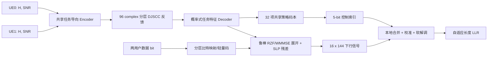

# FATE-MIMO：面向 DataFountain 1176 的获奖级技术方案（V1）

> Fairness-Aware Task-oriented End-to-End MU-MIMO
>
> 目标：同时冲击 A 榜性能与 B 榜创新潜力；第一优先级是 A 榜可复现提升，第二优先级是形成可解释、可消融、与下一代通信标准方向一致的技术故事。

## 1. 结论先行

推荐采用“模型驱动骨架 + 任务导向学习 + 指标对齐优化”的混合方案；参考 Transformer 保留为接口与对照基线：

1. UE 侧不重构完整 CSI，而是提取对调度和预编码真正有用的等效信道、空间方向、增益和置信度；通过 SNR 条件化的分层 DJSCC，在 96 个复数反馈符号上做不等保护。
2. BS 侧使用不确定性感知的鲁棒 RZF/WMMSE 展开层，并加入数据感知的符号级预编码（SLP）残差，以利用 16 发射天线、2 用户带来的大空间自由度。
3. 5-bit 控制信令作为 32 个共享传输策略的索引；策略对用户置换等变，终端依据本地 `H`、`SNR` 和校准参考信号执行相同规则。
4. 数据链路使用面向“正确 bit 数”而非传统 BLER 的分层比特映射、轻量码和软解调；实际输出长度 `B` 按策略自适应。
5. 训练目标直接拟合官方公式：`0.7 × 均值 + 0.3 × 第 10 百分位`，用 lower-CVaR/软分位数逼近尾部公平性，并保留平均 BCE 作为训练稳定项。

方案名建议使用 **FATE-MIMO**，答辩主张为：

> 从“压缩 CSI 后再通信”升级为“围绕正确 bit 收益和弱用户尾部风险，联合学习反馈、控制、预编码与接收”的内生 AI 空口。

## 2. 赛题约束与真正的优化对象

### 2.1 固定系统约束

| 项目 | 数值/要求 |
| --- | --- |
| 用户数 | 2 |
| BS 发射天线 | 16 |
| 每 UE 接收天线 | 2 |
| 下行子载波 | 144 |
| 上行反馈复数符号 | 每 UE 96 |
| 下行控制 | 5 bit，无损 |
| 下行 SNR | `[-20, 20] dB` |
| 上行 SNR | `SNR_DL - 10 dB` |
| 最大数据量 | 参考评测按每 UE 1152 bit，总计 2304 bit |
| 提交包 | `modelDesign.py` + 3 个权重文件 |
| 包大小/推理 | 小于 1 GB / 小于 1000 s |

### 2.2 评分公式的关键含义

参考评测中每个 UE 的 `B_max=1152`。原公式可改写为：

\[
\mu
=50+\frac{100}{1152}\sum_{k=1}^{B}
\left(\mathbf 1[\hat b_k=b_k]-0.5\right).
\]

因此：

- 未传输 bit 自动按 50% 正确率计分，基准分是 50。
- 一个 bit 只有在正确率高于 50% 时才有正的期望增益。
- 评分按正确 bit 数，不按整块是否成功；传统“追求极低 BLER”的强信道编码不一定最优。
- `B`、bit 可靠度和错误相关性必须联合优化。低 SNR 下应使用平滑降级的比特级 JSCC/分层调制，高 SNR 下再追求大载荷。
- 公平分是所有样本和用户得分的第 10 百分位，不能长期牺牲某个用户。极端 SU 只应作为少数场景的保底策略，常用回退应是弱用户保护的 MU 或正交/准正交双用户传输。

## 3. 训练数据实证分析

数据文件为未压缩 NPZ，包含 `real.npy` 和 `imag.npy`：

```text
shape = (100000, 2, 2, 16, 144)
dtype = float16（实部、虚部分开）
```

以下统计来自固定随机种子抽取的 512 个样本，仅用于架构选择，不是排行榜结果。

| 统计量 | 结果 | 对设计的含义 |
| --- | ---: | --- |
| 相邻子载波相关系数均值 | 0.9994 | 可做强频域共享和稀疏导频/参考信号 |
| 间隔 12 子载波相关系数均值 | 0.9464 | 12 子载波一组较合理 |
| 48 子载波分段常量 NMSE 均值 | 17.63% | 参考代码的 3 子带过粗 |
| 12 子载波分段常量 NMSE 均值 | 2.84% | 推荐改为 12 组，每组 12 子载波 |
| 时延域前 2 tap 平均能量 | 87.81% | 反馈前先转角度-时延域很有价值 |
| 时延域前 4 tap 平均能量 | 95.15% | 96 个复数反馈符号足以承载任务特征 |
| 90% 能量所需时延 tap | 中位数 2，90 分位 5 | 可用稀疏门控/可学习软阈值 |
| 发射角域前 4 beam 平均能量 | 83.81% | 适合角域压缩与 codebook warm start |
| 两 UE 主波束重叠度 | 中位数 0.130，90 分位 0.489 | 多数样本适合 MU，尾部样本需要 OMA/SU 回退 |
| 两 UE 信道功率差 | 中位数 2.82 dB，90 分位 6.93 dB | 必须做弱用户功率保护和尾部训练 |
| 第二空间模态能量占比 | 均值 21.61% | 每 UE 默认单流合理，但第二接收天线应参与合并/干扰抑制 |

相邻训练样本的全信道相关度与远距离样本没有明显差异，未发现强时序轨迹泄漏；仍建议按信道功率、稀疏度和用户波束重叠度分层切分训练/验证/测试集。

## 4. 参考方案诊断

参考代码适合作为接口样例，但存在以下明确上限：

1. `Encoder.forward(h, snr)` 实际未使用 `snr`，无法根据 `SNR_UL=SNR_DL-10` 调整反馈保护强度。
2. 144 个子载波仅划为 3 个、每个 48 子载波的子带；数据统计表明平均近似误差约 17.6%，尾部更高。
3. 始终按每子载波 8 bit、每 UE 1152 bit 发送，没有载荷、调制、编码或 MU/SU 自适应。
4. 控制 bit 固定全 1，Receiver 也未使用控制输入。
5. 预编码器输出连续波束，但 Receiver 不知道另一个 UE 的反馈或实际预编码矩阵，也没有显式参考信号；接收端存在“不可观测的等效信道”问题。
6. 训练只优化两个 UE 的平均 BCE，没有匹配官方正确 bit 得分，也没有显式优化第 10 百分位公平性。
7. 模型固定做 MU 传输，未处理高波束重叠、巨大用户功率差或极低反馈 SNR。
8. 数据加载会把 3.4 GiB 左右的 float16 数据扩成 complex64，并产生多个临时数组；可显著降低内存和启动效率。

## 5. FATE-MIMO 总体架构



### 5.1 UE：任务导向的角度-时延分层 DJSCC

#### 输入表示

1. 对频域做 IFFT、对 16 发射天线做 DFT，得到角度-时延表示。
2. 用可学习软阈值保留稀疏主径，同时保留一条原始频域残差支路，避免固定变换丢失信息。
3. 将 144 子载波切为 12 组，每组 12 个；每组提取：
   - 主等效发射方向；
   - 两个空间奇异值/增益；
   - 频率选择性指标；
   - 本地合并向量对应的等效信道；
   - CQI 和不确定性提示。

#### 反馈分层

将 96 个复数符号划为逻辑上的两层，但最终仍一次输出并统一归一化：

- **Base layer**：粗波束、宽带增益、CQI、低频子带趋势。采用重复/扩频和更高能量占比，保证极低上行 SNR 时仍可做保底调度。
- **Enhancement layer**：12 组频域细节、角度-时延残差和相位修正。上行 SNR 较好时提高预编码精度。

网络显式输入 `snr_dl`，等价知道 `snr_ul`，通过 FiLM/gating 自适应两层的能量分配。由于评测会对整个反馈向量再次归一化，CQI 不能编码在总幅度上，必须编码在相对能量、相对相位或扩频码相关值中。

#### BS 输出

不要求重构完整 `2×16×144` CSI。Decoder 输出每组任务充分统计量：

\[
(\hat g_{i,g},\; \hat \lambda_{i,g},\; \hat \sigma^2_{i,g},\; \widehat{CQI}_{i}),
\]

其中 `g` 为本地接收合并后的 16 维等效信道，`σ²` 表示反馈不确定性。辅助 CSI/特征重构损失只用于稳定预训练，最终以数据 bit 得分为主。

### 5.2 BS：置换等变的 32 项传输策略码本

5-bit 控制映射到 32 个 profile。每个 profile 不是简单的“用户 0/用户 1 参数对”，而是一个双方共享的策略函数，定义：

- 12 个频率组采用 MU、弱用户保护 MU、正交/准正交还是极端 SU；
- 鲁棒正则强度和功率分配规则；
- 本地 CQI/SNR 到实际载荷 `B`、比特层数和解调方式的映射；
- 校准参考信号形式；
- Receiver 残差专家编号。

这一设计解决了参考接口的隐藏约束：两个用户调用的是同一个 Receiver，且 Receiver 没有用户 ID。策略必须对交换两个用户保持等变；终端根据自身 `H`、`SNR`、控制索引和参考信号执行相同规则。训练时随机交换 UE 顺序并加入一致性损失。

码本训练分两阶段：

1. 用基于信道增益、波束重叠、反馈置信度和 SNR 的人工 32 profile warm start。
2. 用 straight-through Gumbel-Softmax/向量量化联合优化，最后冻结为硬索引，确保实际输出严格为 5 个二进制 bit。

### 5.3 鲁棒预编码：RZF/WMMSE 展开 + 符号级残差

每 12 个子载波共用一个慢变预编码基座，初始化为不确定性感知 RZF：

\[
W_g=\hat G_g^H
\left(\hat G_g\hat G_g^H+
\operatorname{diag}(\alpha_g+\rho\hat\sigma_g^2)\right)^{-1}
P_g^{1/2}.
\]

这里只需求 `2×2` 逆，速度快且数值稳定。之后展开 2～4 步投影 WMMSE/梯度更新，学习正则、步长和弱用户权重。

在其上增加轻量符号级预编码残差。Transmitter 已知两用户当前 bit/调制符号，因此可把原本有害的多用户干扰推入正确星座判决区域。优化形式可写为：

\[
\min_{x_s}\;
\sum_i \ell_{\text{decision}}
(\hat g_{i,s}x_s,d_{i,s},m_i)
+\lambda\|x_s\|_2^2
+\rho\sum_i\hat\sigma_{i,s}^2\|x_s\|_2^2.
\]

只展开少量迭代，并限制残差幅度，避免对反馈误差过敏。低上行 SNR 时门控自动退回鲁棒 RZF/开环空间频率分集。

### 5.4 数据映射：优化 Hamming 收益，而非照搬 BLER 最优 MCS

建议并行实现两条数据链并以本地得分选择：

1. **经典可控线**：Gray QAM/分层 QAM + 轻量 rate-compatible Polar/LDPC 或线性码 + 软解码。
2. **评分定制线**：系统 bit + 少量可学习校验/跨频率混合 + 分层星座/神经 demapper，直接最大化正确 bit 增益。

重点比较“无强码、高 B、每 bit 略高于 0.5”和“强码、低 B、高可靠”两类方案。因为官方按正确 bit 计分，强 FEC 可能降低期望正确 bit 总增益；最终只能由精确本地评测决定。

建议初始载荷档位覆盖 `B∈{72,144,288,432,576,768,960,1152}`，再由 32 profile 合并为最常用组合。训练和推理中都只解码前 `B` 个 bit。

### 5.5 Receiver：本地可观测、模型驱动、共享参数

Receiver 使用：

- 本地完整 `H_i`；
- `Y_i`；
- 本地 `SNR_i`；
- 5-bit profile；
- 下行信号中的低功率叠加参考序列/少量稀疏参考子载波。

处理链：

1. 从本地 `H_i` 计算与 Encoder 一致的接收合并向量。
2. 通过参考序列估计真实的等效增益、全局功率归一化尺度和残余相位；这一步补上参考方案“接收端不知道实际预编码”的缺口。
3. 做解析 LMMSE/干扰抑制，得到初始 soft symbol。
4. 用共享的小型频域残差网络修正模型误差。
5. 由 profile 和本地 CQI/SNR 选择 bit 层与输出长度，输出 float32 LLR。

完整原始 `H` 进入 6 层大 Transformer 的计算成本较高，且没有解决等效信道可观测性。这里先做解析合并，再让小型网络处理等效信道残差，以减小模型体量并提升外推和解释性。

## 6. 与官方指标严格对齐的训练目标

令真实 bit 的符号标签 `t=2b-1`，LLR 为 `c`，软正确概率为：

\[
p_k=\sigma(t_k c_k).
\]

单用户软得分：

\[
\tilde\mu
=50+\frac{100}{1152}
\sum_{k=1}^{B}(p_k-0.5).
\]

对 batch 内全部样本和用户，主目标设为：

\[
J=0.7\,\mathbb E[\tilde\mu]
+0.3\,\operatorname{LCVaR}_{0.1}(\tilde\mu),
\]

其中 lower-CVaR 使用可微形式：

\[
\operatorname{LCVaR}_{\alpha}
=\max_{\eta}
\left[\eta-\frac{1}{\alpha}
\mathbb E(\eta-\tilde\mu)_+\right].
\]

lower-CVaR 比单纯软分位数更稳定，并对最差 10% 样本提供持续梯度。最终损失为：

\[
\mathcal L
=-J
+\lambda_1\mathcal L_{BCE}
+\lambda_2\mathcal L_{taskCSI}
+\lambda_3\mathcal L_{uncertainty}
+\lambda_4\mathcal L_{policy-balance}.
\]

训练后期逐步降低辅助损失权重，以官方分数代理为主。每隔固定步数用硬判决、真实 `B` 和 NumPy 第 10 百分位做无梯度校验，防止软目标与真实指标错位。

## 7. 训练路线

### 阶段 0：评测与上界（必须先做）

建立同一数据切分和同一随机噪声种子的以下基线：

1. 随机猜测/最小 `B`：确认 50 分基线。
2. 开环固定波束 + BPSK/QPSK。
3. 完美 CSI 的 MRT、RZF、WMMSE。
4. 完美 CSI + 自适应载荷。
5. 完美 CSI + SLP。

这些结果给出反馈压缩、预编码、接收和载荷控制各自的可提升空间。如果完美 CSI 上界都不高，应先修数据链，不能继续堆反馈网络。

### 阶段 1：稳定的数据链

- 固定完美 CSI 和解析 RZF。
- 训练/搜索各载荷档位的比特映射和 Receiver。
- 以精确得分而非 BER/BLER 选择 Pareto 前沿。
- 输出每个 SNR、信道功率和波束重叠区间的得分曲线。

### 阶段 2：任务导向反馈

- 先训练角度-时延 Encoder/Decoder 的特征重构和不确定性校准。
- 混合采样 `SNR_UL∈[-30,10] dB`。
- 比较完整 CSI NMSE、等效信道 NMSE、完美预编码性能差距和最终 bit 得分；模型选择以最后一项为准。
- 加入 base/enhancement layer 消融。

### 阶段 3：鲁棒预编码与控制

- 用完美 CSI 的 RZF/WMMSE/SLP 解作为教师 warm start。
- 训练不确定性感知的展开层。
- 加入 32-profile 软选择，再退火为硬选择。
- 随机交换用户顺序，验证两个用户统计完全对称。

### 阶段 4：端到端公平性微调

- 先冻结数据映射，仅联调反馈、控制和预编码。
- 再解冻 Receiver/映射器，以小学习率联合训练。
- batch 中 50% 按真实均匀 SNR 采样，50% 重点采样低 SNR、低信道功率、高波束重叠和大用户功率差；对主目标使用重要性权重还原真实分布。
- 使用 EMA/SWA 权重；只保留一个模型，不做高延迟大集成。

## 8. 验证、消融与提交策略

### 8.1 数据切分

- 80% 训练、10% 验证、10% 本地私榜。
- 按每 UE 信道功率、两用户功率差、主波束重叠度、时延稀疏度分箱分层。
- 本地私榜在开发期保持不可见，防止阈值过拟合。

### 8.2 评测统计

每个候选模型至少：

- 运行 5 个独立噪声/bit 随机种子；
- 报告效率分、公平分、总分的均值和 95% bootstrap 置信区间；
- 报告 `SNR`、信道增益、用户功率差、波束重叠度四个维度的切片指标；
- 记录推理时间、峰值显存、模型大小和 NaN/Inf 检查。

只有当本地总分提升超过噪声置信区间且尾部没有退化时，才占用每日 3 次提交机会。

### 8.3 最小消融矩阵

| 编号 | 变化 | 要回答的问题 |
| --- | --- | --- |
| A0 | 参考方案 | 官方起点 |
| A1 | 48→12 子载波分组 | 数据驱动频率粒度是否有效 |
| A2 | + 角度-时延稀疏前端 | 是否提升反馈效率 |
| A3 | + SNR 条件化分层 DJSCC | 是否改善低反馈 SNR |
| A4 | + 鲁棒 RZF/WMMSE 展开 | 是否利用反馈置信度 |
| A5 | + 自适应 `B`/分层 bit | 是否直接提升官方分数 |
| A6 | + 32-profile 控制 | MU/弱保护/回退是否有效 |
| A7 | + SLP 残差 | 数据感知预编码的净收益 |
| A8 | BCE→均值目标 | 指标对齐收益 |
| A9 | 均值→均值+LCVaR | 第 10 百分位收益 |
| A10 | 去掉参考校准信号 | 验证接收可观测性的重要性 |

## 9. 工程实现建议

1. 将未压缩 NPZ 内两个 `.npy` 条目直接 memmap，或一次性解出为 `.npy`；DataLoader 只在 batch 级转 complex64，避免全量扩成约 7.4 GB complex64 及更高临时峰值。
2. `modelDesign.py` 尽量仅依赖 PyTorch，去掉非必要 `einops` 等外部包，所有码表和常量注册为 buffer。
3. 频率组、子载波和用户维度全部向量化；不在 144 子载波上写 Python 循环。
4. 模型目标控制在 5M～15M 参数、FP32 权重小于 100 MB；核心矩阵逆只有 `2×2`。
5. 对复数除法、归一化、eigh/SVD、低能量反馈和极低 SNR 全部加 epsilon、裁剪和有限值检查。
6. 训练用软 profile/软 `B` mask；推理用硬 profile 和硬长度。单元测试必须覆盖 `B=1`、最大 `B`、两个用户不同本地载荷、极低 SNR、零/近零输出能量。
7. 参考评测 `BATCH_SIZE=1`，允许按样本动态输出 `B`。正式提交前要用一次平台反馈确认隐藏评测仍保持这一语义；同时保留固定长度回退版本。

## 10. 风险与备选路线

| 风险 | 处理方式 |
| --- | --- |
| SLP 对反馈误差敏感 | 残差限幅；不确定性惩罚；低上行 SNR 门控退回 RZF |
| 强 FEC 降低正确 bit 总收益 | 保留无强码/轻量码支路，用精确得分选型 |
| 32 个 profile 过早塌缩 | warm start、使用率正则、分阶段硬化 |
| BS 与 UE 的本地载荷判断不一致 | CQI 基础层强保护、阈值留 guard band、训练中注入反馈判决错误 |
| 公平损失拖累均值 | 先优化均值，再逐步把公平权重升到 0.3；观察 Pareto 曲线 |
| 动态 `B` 在隐藏 batch 语义失效 | 同时训练固定长度提交备份；首轮平台验证接口 |
| 端到端训练不稳定 | 完美 CSI 教师、模块预训练、解析骨架、分阶段解冻 |

## 11. B 榜答辩的四个创新点

1. **评分原生的风险敏感 PHY**：把正确 bit 效用与第 10 百分位公平性直接写入端到端目标，并用硬指标校验软代理的一致性。
2. **决策充分、分层抗噪的反馈**：利用角度-时延稀疏性反馈等效信道和不确定性，不追求与最终任务弱相关的全 CSI NMSE。
3. **数据感知的鲁棒符号级预编码**：联合当前 bit、反馈置信度和多用户空间关系，把干扰转为构造性信号，并保留解析 RZF/WMMSE 的可解释骨架。
4. **受限控制信令下的共享策略码本**：5 bit 对应 32 个置换等变 profile，体现 UE-gNB 双侧协同、模型生命周期和标准化接口意识。

该叙事与 3GPP 对 AI/ML 空口中 CSI 压缩、双侧协同和 beam management 的方向一致。3GPP 已将 CSI enhancement、beam management 和 UE/gNB 双侧模型协同列为 AI/ML 空口重点；近期研究也验证了 DJSCC 联合 CSI 反馈/多用户预编码、任务导向反馈和 WMMSE 展开的合理性。

## 12. 参考方向

- [Deep Joint Source-Channel Coding for CSI Feedback: An End-to-End Approach](https://arxiv.org/abs/2203.16005)
- [Deep Joint CSI Feedback and Multiuser Precoding for MIMO OFDM Systems](https://arxiv.org/abs/2404.16289)
- [Joint CSI Estimation-Feedback-Precoding via DJSCC for MU-MIMO OFDM Systems](https://arxiv.org/abs/2503.04157)
- [Precoding-oriented Massive MIMO CSI Feedback Design](https://arxiv.org/abs/2302.11526)
- [Deep unfolding of the weighted MMSE beamforming algorithm](https://arxiv.org/abs/2006.08448)
- [3GPP: AI/ML for NR Air Interface](https://www.3gpp.org/technologies/ai-ml-nr)

## 13. 建议的首轮落地顺序

第一轮不要同时实现全部创新，按下列顺序拿到可信增益：

1. 重写可复现评测器、memmap 数据管线和完美 CSI 上界。
2. 做 `12×12` 子带的解析 RZF + 可观测 Receiver + 载荷搜索，建立强模型驱动基线。
3. 上角度-时延任务导向 DJSCC，先只替换反馈。
4. 加官方分数代理和 lower-CVaR，解决公平性。
5. 加 32-profile 控制。
6. 最后加入限幅 SLP 残差；只有本地精确指标稳定提升才保留。

这一路线既能快速形成首个可提交版本，也能把每个创新点的净收益分离出来，适合 A 榜迭代和 B 榜答辩。
